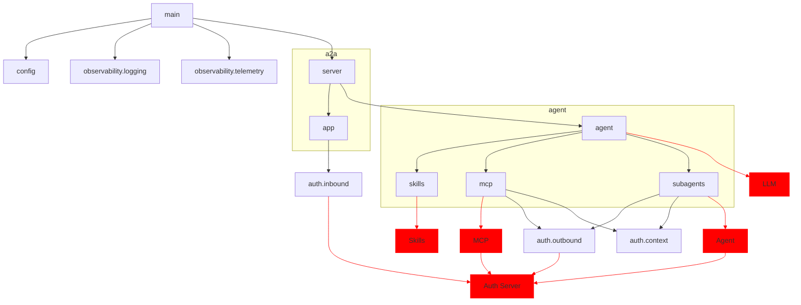

```mermaid
flowchart TD
    subgraph agent_module["agent"]
        agent
        mcp
        subagents
        skills
    end

    subgraph a2a
        server
        app
    end

    auth_server["Auth Server"]
    style auth_server fill:#f00,stroke:#f00
    style LLM fill:#f00,stroke:#f00
    style Skills fill:#f00,stroke:#f00
    style MCP fill:#f00,stroke:#f00
    style Agent fill:#f00,stroke:#f00

    main --> config
    main --> observability.logging
    main --> observability.telemetry
    main --> server

    server --> app
    server --> agent

    app --> auth.inbound

    auth.inbound -->auth_server
    linkStyle 7 stroke:#f00

    agent --> skills
    agent --> mcp
    agent --> subagents
    agent --> LLM
    linkStyle 11 stroke:#f00

    skills --> Skills
    linkStyle 12 stroke:#f00

    mcp --> MCP
    linkStyle 13 stroke:#f00
    mcp --> auth.outbound
    mcp --> auth.context
    MCP --> auth_server
    linkStyle 16 stroke:#f00

    subagents --> auth.outbound
    subagents --> auth.context
    subagents --> Agent
    linkStyle 19 stroke:#f00

    Agent --> auth_server
    linkStyle 20 stroke:#f00

    auth.outbound --> auth_server
    linkStyle 21 stroke:#f00
```
